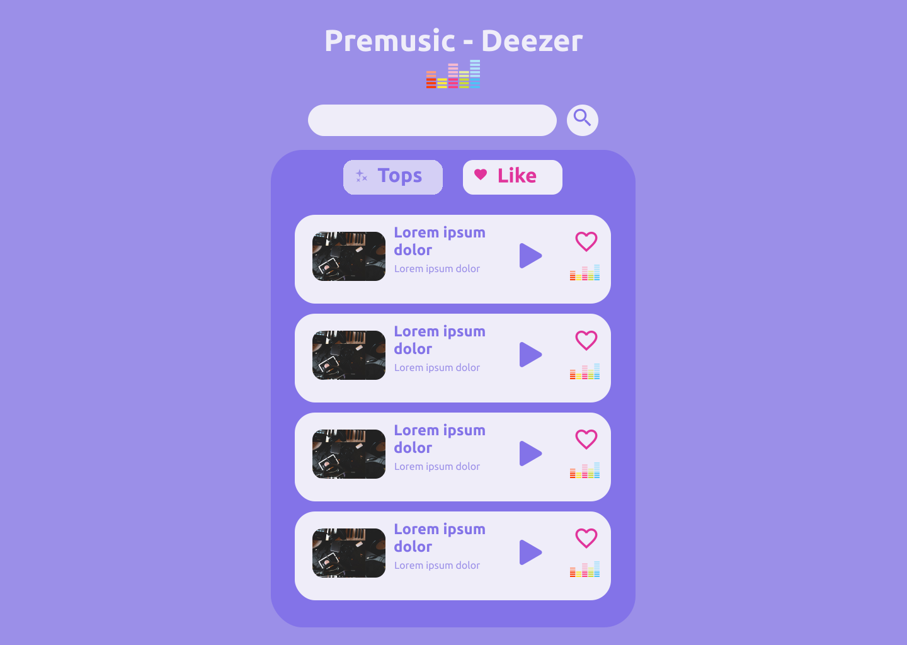

<div align="center">
  

---

  
</div>

## ✨️ Technologies

- ReactJS
- Typescript
- Redux

### 📖 Libraries

- Redux Toolkit
- Styled Components

## 🎉 Project

Application to listen to a preview of current songs, bookmark and search and discover new sounds.

> The requirements of challenge to create app are [here](https://github.com/MelkdeSousa/premusic-deezer/.github/challenge.md)

## 🏃 Run app

- Web
  - Access [here](https://premusic-deezer.vercel.app)
- Your machine
  - Clone the repository:
  ```bash
  $ git clone https://github.com/MelkdeSousa/premusic-deezer.git
  ```
  - Install dependecies:
  ```bash
  npm install
  # or
  yarn
  ```
  - Start
  ```bash
  yarn start
  ```
  - Access http://localhost:3000

---

Created by [@MelkdeSousa](https://github.com/MelkdeSousa)✌️😎
